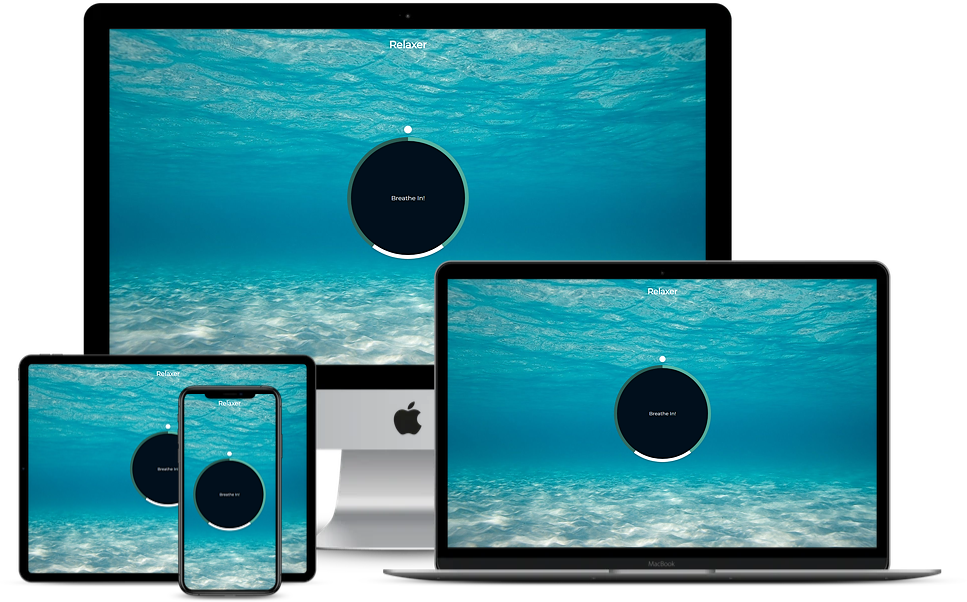
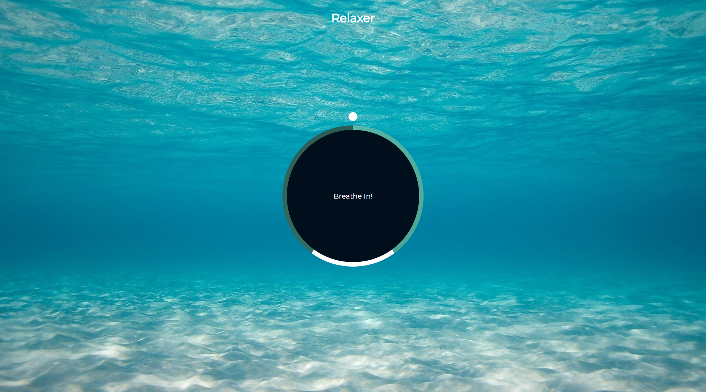

## Relaxer App

A relaxing breathing app with a visual director to tell you when to breathe in, hold and breathe out.

## Project Specifications

- Create circle and gradient circle with CSS
- Create and animate pointer (Small circle)
- Create grow and shrink animations
- Add JavaScript to create the breath animation effect
  
## Steps to execute this calculator:
- Download the entire code 
- Open up the index.html.

## Technologies used: 
- HTML
- CSS [style/Presentation]
- Javascript [Logic/Working of App]
  
# Full Page View

